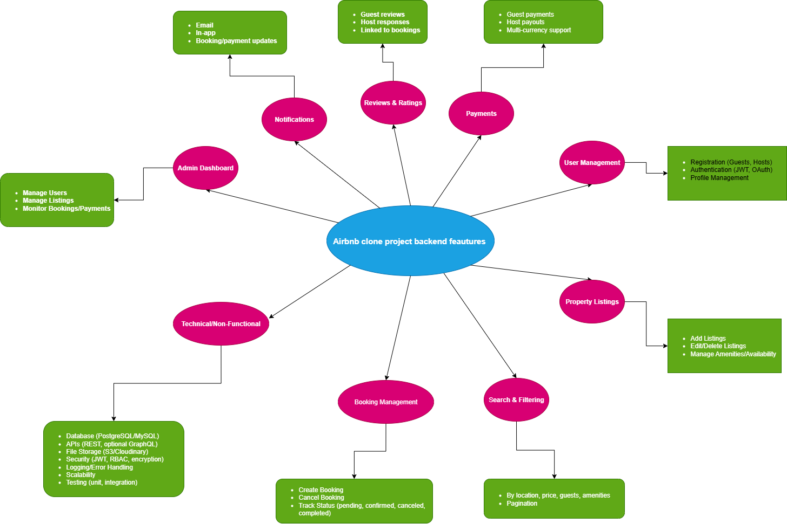

# 🌍 Airbnb Clone Backend – Features & Functionalities

This document outlines the **core features and functionalities** of the Airbnb Clone backend.  
It also references a **diagram** created with [Draw.io (diagrams.net)](https://app.diagrams.net) that visualizes the system’s architecture and relationships.

---

## 📌 1. User Management
- 👤 **User Registration**
  - Guests, Hosts, and Admins
- 🔑 **Authentication**
  - JWT / OAuth
- 📝 **Profile Management**
  - Update details  
  - Password reset

---

## 🏡 2. Property Listings
- ➕ Add, edit, delete listings  
- 📅 Manage availability & amenities  
- 🖼 Upload property photos  

---

## 🔍 3. Search & Filtering
- Search by:
  - Location  
  - Price  
  - Dates  
  - Guests  
- Filter by:
  - Amenities  
  - Property type  
- 📑 Pagination & sorting  

---

## 📆 4. Booking Management
- Create & manage bookings  
- Cancel or update reservations  
- Track booking status:
  - Pending  
  - Confirmed  
  - Canceled  
  - Completed  

---

## 💳 5. Payments
- Guest payments (cards, wallets, etc.)  
- Host payouts  
- 💱 Multi-currency support  

---

## ⭐ 6. Reviews & Ratings
- Guests leave reviews & ratings  
- Hosts respond to reviews  
- Reviews linked to completed bookings  

---

## 🔔 7. Notifications
- 📧 Email notifications  
- 📱 In-app notifications  
- Booking & payment updates  

---

## 🛠 8. Admin Dashboard
- Manage users & properties  
- Monitor bookings & payments  
- Generate reports & analytics  

---

## ⚙️ 9. Technical & Non-Functional Requirements
- **Database:** PostgreSQL / MySQL  
- **API:** REST (optionally GraphQL)  
- **File Storage:** AWS S3 / Cloudinary  
- **Security:** JWT, RBAC, encryption  
- **Logging & Error Handling**  
- **Scalability & Testing** (unit & integration tests)  

---

## 📊 Diagram

A high-level architecture diagram was created with **Draw.io**.  

👉 Exported as:  
`features-and-functionalities/features-and-functionalities.png`

---

