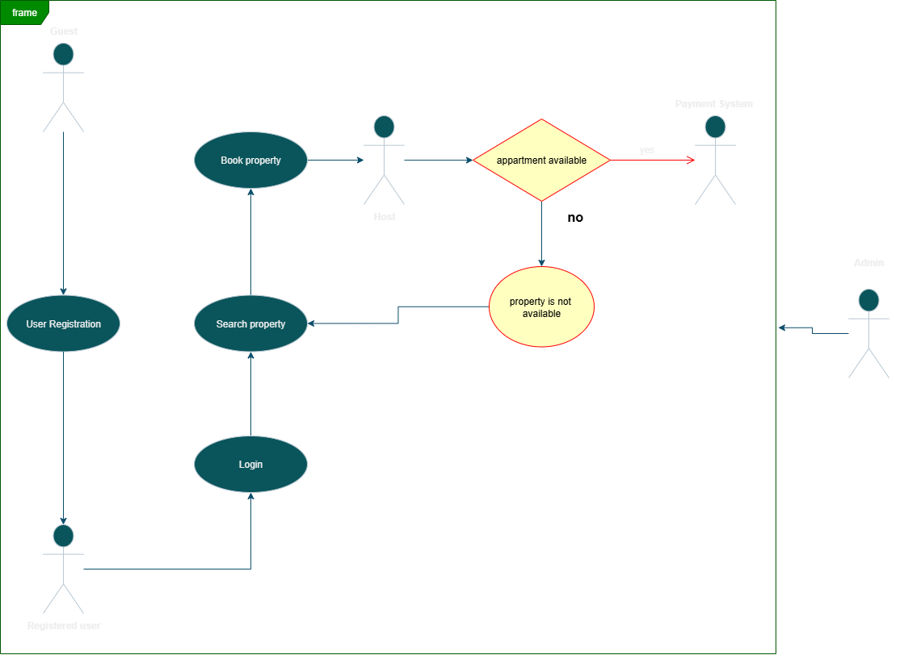

# Use Case Diagram - Airbnb Clone

## 📌 Objective
This use case diagram visualizes the main interactions between users (actors) and the Airbnb Clone backend system. It highlights how guests, registered users, hosts, and admins interact with the system’s key functionalities.

---

## 🎭 Actors
- **Guest** → Browses and registers on the platform.  
- **Registered User** → Can search, book, cancel, and pay for properties.  
- **Host** → Manages property listings (add, edit, remove).  
- **Admin** → Manages users and oversees the system.  
- **Payment System (External Service)** → Handles transactions securely.  

---

## 🔑 Use Cases
1. **User Registration & Authentication** (Guest → Registered User)  
2. **Search Property** (Guest & Registered User)  
3. **Book Property** (Registered User)  
4. **Cancel Booking** (Registered User)  
5. **View Booking History** (Registered User)  
6. **Manage Property** (Host)  
7. **Process Payment** (Registered User ↔ Payment System)  
8. **Manage Users** (Admin)  
9. **Monitor System** (Admin)  

---

## 🖼️ Diagram

---
